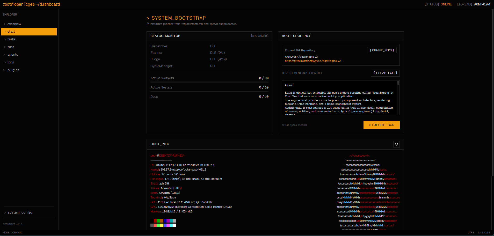

# 🐯openTiger — Orquestación de desarrollo autónomo que nunca se detiene

**Sitio web**: [opentiger.dev](https://opentiger.dev) | **Documentación**: [opentiger.dev/docs](https://opentiger.dev/docs/)

<p align="center">
  
</p>

openTiger ejecuta continuamente:

1. ingesta de requisitos/incidencias
2. planificación y despacho de tareas
3. actualizaciones de implementación/pruebas/documentación
4. revisión/evaluación
5. recuperación/reintento/retrabajo

todo bajo transiciones explícitas de estado en tiempo de ejecución.

<p align="center">
  
</p>

## Características principales

- Generación de tareas ejecutables a partir de requisitos
- Ejecución basada en roles (`worker` / `tester` / `docser`)
- Evaluación para PR, worktree local y modo directo (`judge`)
- Operación priorizada a la recuperación (`quota_wait`, `awaiting_judge`, `needs_rework`)
- Inicio priorizado al backlog (el backlog de Incidencias/PR se procesa antes de la nueva planificación)
- Interfaz de chat conversacional para entrada de requisitos y control de ejecución
- Panel de control (Dashboard) + API para control de procesos, registros y configuración del sistema
- Cambio en tiempo de ejecución entre proceso del host y ejecución en sandbox de Docker

## Plugins

- Expansión de características primero con plugins
- Plugin TigerResearch (convergencia de afirmación/evidencia con prioridad al planificador) como implementación de referencia
- Activación de plugins mediante `ENABLED_PLUGINS` (CSV)
- Endpoint de inventario de plugins: `GET /plugins`
- Las rutas de TigerResearch se exponen únicamente bajo `/plugins/tiger-research/*`
- Consulte [docs/plugins.md](docs/plugins.md) para la guía de arquitectura e implementación de plugins

## Descripción general de la arquitectura

- **API (`@openTiger/api`)**: endpoints de sistema/configuración/control y backend del panel
- **Planner (Planificador)**: genera tareas a partir de requisitos/incidencias
- **Dispatcher (Despachador)**: asigna y despacha tareas en cola
- **Worker/Tester/Docser**: ejecuta cambios y verificación de tareas
- **Judge (Evaluador)**: evalúa ejecuciones exitosas e impulsa decisiones de fusión/retrabajo
- **Cycle Manager (Gestor de ciclos)**: ciclo de convergencia, limpieza, reintento y desencadenante de replanificación
- **PostgreSQL + Redis**: estado persistente + gestión de colas

Consulte [docs/architecture.md](docs/architecture.md) para detalles a nivel de componente.
Consulte [docs/research.md](docs/research.md) para el diseño y operación de TigerResearch.
Consulte [docs/plugins.md](docs/plugins.md) para la arquitectura de extensión de plugins.

## Requisitos previos

- Node.js `>=22.12`
- pnpm `9.x`
- Docker (para BD/Redis locales y modo de ejecución en sandbox)
- Comando `gh` (o token de GitHub con permisos adecuados)
- ClaudeCode, Codex, etc., o claves API para cada proveedor al usar OpenCode

## Instalación

### Recomendado (script de arranque)

```bash
curl -fsSL https://opentiger.dev/install.sh | bash
```

### Manual (clonar y configurar)

```bash
git clone git@github.com:Andyyyy64/openTiger.git
cd openTiger
pnpm run setup
```

## Inicio rápido

```bash
pnpm run up
```

`pnpm run up` realiza lo siguiente:

- compilación del monorepo
- iniciación de `postgres` / `redis` mediante docker compose
- implementación (push) del esquema de la BD
- desactivación del bloqueo de tiempo de ejecución (hatch)
- exportación de configuración de BD a `.env`
- inicio del modo dev de API + Panel

## Lista de verificación para primera ejecución

1. Autenticar la CLI de GitHub (modo de autenticación predeterminado):

   ```bash
   gh auth login
   ```

2. Si utiliza el ejecutor Claude Code, autentíquese en el host:

   ```bash
   claude /login
   ```

3. Si utiliza el ejecutor Codex, autentíquese en el host (o configure `OPENAI_API_KEY` / `CODEX_API_KEY`):

   ```bash
   codex login
   ```

4. Abrir el Panel:
   - Panel: `http://localhost:5190`
   - API: `http://localhost:4301`
5. Ingresar el requisito en la página de Chat y ejecutar
   - Describa lo que desea construir; el LLM genera un plan de forma autónoma
   - Seleccione el modo de ejecución (Directo / Git Local / GitHub) para comenzar
   - ruta canónica predeterminada para requisitos: [docs/requirement.md](docs/requirement.md)
6. Monitorear el progreso:
   - `tasks`
   - `runs`
   - `judgements`
   - `logs`
7. (Opcional) Ejecutar TigerResearch desde la página `plugins`:
   - enviar consulta -> descomposición del planificador -> recopilación/repteo/redacción en paralelo -> informe
   - detalles: [docs/research.md](docs/research.md)
8. Si el estado se queda estancado:
   - Comience con el diagnóstico inicial en [docs/state-model.md](docs/state-model.md)
   - Consulte la guía operativa detallada en [docs/operations.md](docs/operations.md)

### Guía común de consulta (vocabulario de estado -> transición -> propietario -> implementación)

- Si se encuentran problemas a través de la API:
  - [docs/api-reference.md](docs/api-reference.md) "2.2 API-based lookup (state vocabulary -> transition -> owner -> implementation)"
- Para rastrear transiciones desde el vocabulario de estado:
  - [docs/state-model.md](docs/state-model.md) -> [docs/flow.md](docs/flow.md)
- Para rastrear hasta el agente propietario y los archivos de implementación:
  - [docs/agent/README.md](docs/agent/README.md) "Shortest route for implementation tracing"

## Comportamiento de inicio y en tiempo de ejecución

- El Planificador se inicia solo cuando las puertas de bloqueo del backlog están despejadas.
- El backlog existente local/Incidencia/PR siempre se prioriza.
- La desactivación del bloqueo en tiempo de ejecución evita que la autogestión del proceso inicie automáticamente workers/judge solo por la existencia de un backlog.
- Orden de convergencia en tiempo de ejecución:
  - `local backlog > 0`: continuar ejecución
  - `local backlog == 0`: sincronizar backlog de Incidencias vía verificación previa (preflight)
  - `Issue backlog == 0`: evaluar replanificación del planificador

Detalles: [docs/startup-patterns.md](docs/startup-patterns.md), [docs/flow.md](docs/flow.md)

## Mapa de documentación

**En línea**: [opentiger.dev](https://opentiger.dev) | [Documentación](https://opentiger.dev/docs/)

Primero consulte el índice por caso de uso:

- [docs/README.md](docs/README.md)
  - incluye rutas de lectura (primera vez/operaciones/rastreo de implementación)

Orden recomendado para incorporación:

- [docs/getting-started.md](docs/getting-started.md)
- [docs/architecture.md](docs/architecture.md)
- [docs/config.md](docs/config.md)
- [docs/api-reference.md](docs/api-reference.md)
- [docs/operations.md](docs/operations.md)
- [docs/api-reference.md](docs/api-reference.md) "2.2 API-based lookup (state vocabulary -> transition -> owner -> implementation)"

Referencia de comportamiento en tiempo de ejecución:

- [docs/state-model.md](docs/state-model.md)
- [docs/flow.md](docs/flow.md)
- [docs/startup-patterns.md](docs/startup-patterns.md)
- [docs/mode.md](docs/mode.md)
- [docs/execution-mode.md](docs/execution-mode.md)
- [docs/policy-recovery.md](docs/policy-recovery.md)
- [docs/verification.md](docs/verification.md)
- [docs/research.md](docs/research.md)
- [docs/plugins.md](docs/plugins.md)

Referencia de especificación de agentes:

- [docs/agent/README.md](docs/agent/README.md) (comparación de roles)
- [docs/agent/planner.md](docs/agent/planner.md)
- [docs/agent/dispatcher.md](docs/agent/dispatcher.md)
- [docs/agent/worker.md](docs/agent/worker.md)
- [docs/agent/tester.md](docs/agent/tester.md)
- [docs/agent/judge.md](docs/agent/judge.md)
- [docs/agent/docser.md](docs/agent/docser.md)
- [docs/agent/cycle-manager.md](docs/agent/cycle-manager.md)

Principios de diseño:

- [docs/nonhumanoriented.md](docs/nonhumanoriented.md)

## Notas sobre autenticación y control de acceso

- El middleware de autenticación de la API soporta:
  - `X-API-Key` (`API_KEYS`)
  - `Authorization: Bearer <token>` (`API_SECRET` o validador personalizado)
- Los endpoints `/health` y de webhook de GitHub (`/webhook/github`, `/api/webhook/github` al usar prefijo de API) omiten la autenticación.
- El acceso al control del sistema (`/system/*`, `POST /logs/clear`) se verifica mediante `canControlSystem()`:
  - `api-key` / `bearer`: siempre permitido
  - fallback local inseguro: permitido a menos que `OPENTIGER_ALLOW_INSECURE_SYSTEM_CONTROL=false`

## Alcance del OSS

openTiger está optimizado para flujos de trabajo autónomos de repositorios de larga duración con rutas de recuperación explícitas.  
No **garantiza** el éxito en un solo intento bajo todas las condiciones externas, pero está diseñado para evitar estancamientos silenciosos y converger continuamente cambiando la estrategia de recuperación.
