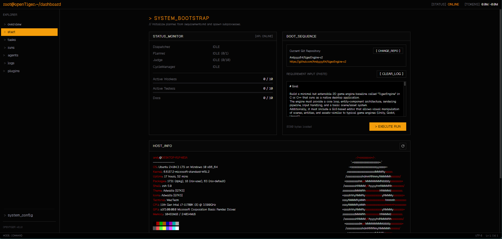

# openTiger


**Never-stalling autonomous development orchestration.**

openTiger continuously runs requirement-to-task generation, implementation, review, and recovery using multiple agents.



---

Docs: [Index](docs/README.md) | [Flow](docs/flow.md) | [Modes](docs/mode.md) | [Agents](docs/agent)

---

## What It Can Do

- Generate executable tasks from requirements
- Run implementation in parallel with Worker / Tester / Docser roles
- Review with Judge and apply auto-merge decisions
- Self-recover on failure (retry, rework, re-evaluate)
- Monitor tasks, runs, and agents from one dashboard

## What Makes It Different

- Prioritizes “do not stall” over first-attempt perfection
- Does not claim guaranteed completion; it keeps running and switches recovery strategy when progress patterns degrade
- Backlog-first startup
  - Existing issues/PRs are processed before generating new plans
- Explicit recovery states
  - `awaiting_judge` / `quota_wait` / `needs_rework`
- Duplicate-execution defenses
  - lease, runtime lock, and judge idempotency
- Planner is single-instance; execution agents can scale horizontally

## How To Use

### 1. Setup

```bash
git clone git@github.com:Andyyyy64/openTiger.git
cd openTiger
pnpm install
cp .env.example .env
```

### 2. Start

Fastest path:

```bash
pnpm run up
```

### 3. Access

- Dashboard: `http://localhost:5190`
- API: `http://localhost:4301`

### 4. First Run Flow

1. Configure GitHub, model, and API keys in Dashboard `system_config`
2. Load `requirement.md` and start
3. Monitor progress in `tasks`, `runs`, and `judgements`

## Best For Teams That

- Need to keep processing even with large issue/PR backlogs
- Want to reduce manual babysitting of autonomous coding loops
- Prefer recovery-first workflows over stop-on-error behavior

## Documentation

- `docs/flow.md`: end-to-end state transitions and convergence flow
- `docs/mode.md`: operating modes and scaling setup
- `docs/config.md`: `/system` and `system_config` settings guide
- `docs/nonhumanoriented.md`: “never stall” design principles
- `docs/agent/*.md`: per-agent responsibilities
