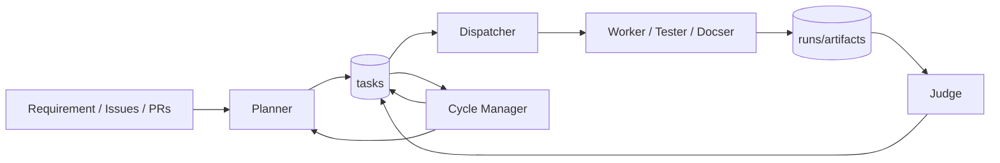

# Architecture Overview

openTiger is an orchestration system that continues autonomous execution using multiple agents and state tables.

Related:

- `docs/state-model.md`
- `docs/flow.md`
- `docs/operations.md`
- `docs/startup-patterns.md`
- `docs/agent/README.md`
- `docs/mode.md`
- `docs/execution-mode.md`

## 0. Runtime Control Loop (Overview)

This loop prioritizes "never stopping"; on failure, recovery strategy is switched via state transition.

### Reading Order for Incident Investigation (Common Lookup Path)

After understanding the architecture, when investigating incidents, tracing in the order state vocabulary -> transition -> owner -> implementation is shortest.

1. Confirm state vocabulary in `docs/state-model.md`
2. Check transitions and recovery paths in `docs/flow.md`
3. Run API procedures and operational shortcuts in `docs/operations.md`
4. Identify owning agent and implementation tracing path in `docs/agent/README.md`

## 1. Components

### Service Layer (API / `@openTiger/api`)

- Dashboard backend
- Config management (`/config`)
- System control (`/system/*`)
- Read APIs (`/tasks`, `/runs`, `/agents`, `/plans`, `/judgements`, `/logs`)

### Planning Layer (Planner / `@openTiger/planner`)

- Generate task plans from requirement / issue
- Dependency normalization
- Policy application
- Documentation gap detection
- Details: `docs/agent/planner.md`

### Dispatch Control Layer (Dispatcher / `@openTiger/dispatcher`)

- Select `queued` tasks
- Acquire lease
- Assign execution agents
- Process / Docker startup
- Details: `docs/agent/dispatcher.md`

### Execution Layer (Worker / Tester / Docser / `@openTiger/worker`)

- LLM execution (`opencode` or `claude_code`)
- Change verification (commands + policy)
- Commit/push/PR creation (git mode)
- Recovery branching on failure
- Details: `docs/agent/worker.md`, `docs/agent/tester.md`, `docs/agent/docser.md`

### Judgement Layer (Judge / `@openTiger/judge`)

- Evaluate successful runs (CI / policy / LLM)
- Approve / request_changes decision
- Merge / retry / autofix task creation
- Details: `docs/agent/judge.md`

### Convergence Layer (Cycle Manager / `@openTiger/cycle-manager`)

- Cleanup loop
- `failed/blocked` recovery
- Issue backlog sync
- Replan decision
- Details: `docs/agent/cycle-manager.md`

### Dashboard Layer (Dashboard / `@openTiger/dashboard`)

- UI for startup/config/state monitoring
- Process start/stop
- Task/run/judgement/log display

## 2. Data Stores

### Persistent Store (PostgreSQL)

Main tables:

- `tasks`
- `runs`
- `artifacts`
- `leases`
- `events`
- `agents`
- `cycles`
- `config`

### Message Queue (Redis / BullMQ)

- Task queue
- Dead-letter queue
- Worker concurrency/lock control

## 3. High-Level Execution Flow

1. Planner creates tasks (`queued`)
2. Dispatcher acquires lease and moves to `running`
3. Worker/Tester/Docser execute and verify
4. On success: `blocked(awaiting_judge)` or `done`
5. Judge evaluates and moves to `done` / retry / rework
6. Cycle Manager continues recovery and replanning

Details in `docs/flow.md`.

## 4. State Design Characteristics

- Explicit blocked reason
  - `awaiting_judge`
  - `quota_wait`
  - `needs_rework`
  - `issue_linking` (for Planner internal coordination)
- Duplicate execution prevention
  - lease
  - runtime lock
  - Judge idempotency (`judgedAt`, `judgementVersion`)

## 5. Modes and Execution Environment

- Repository mode
  - `git` / `local`
- Judge mode
  - `git` / `local` / `auto`
- Execution environment
  - `host` (process)
  - `sandbox` (docker)

Details in `docs/mode.md` and `docs/execution-mode.md`.
