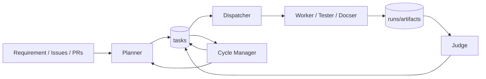

# Architecture Overview

openTiger は、複数エージェントと状態管理テーブルを使って自律実行を継続するオーケストレーションシステムです。

関連:

- `docs/flow.md`
- `docs/startup-patterns.md`
- `docs/agent/README.md`
- `docs/mode.md`
- `docs/execution-mode.md`

## 0. ランタイム制御ループ（概要）

このループは「停止しない」ことを優先し、失敗時に状態遷移で回復戦略を切り替える設計です。

## 1. コンポーネント

### API (`@openTiger/api`)

- Dashboard バックエンド
- 設定管理 (`/config`)
- システム制御 (`/system/*`)
- 参照系 API (`/tasks`, `/runs`, `/agents`, `/plans`, `/judgements`, `/logs`)

### Planner (`@openTiger/planner`)

- requirement / issue からタスク計画を生成
- dependency 正規化
- policy 適用
- doc gap 検知
- 詳細: `docs/agent/planner.md`

### Dispatcher (`@openTiger/dispatcher`)

- `queued` タスクの選別
- lease 取得
- 実行エージェント割り当て
- process / docker 起動
- 詳細: `docs/agent/dispatcher.md`

### Worker / Tester / Docser (`@openTiger/worker`)

- LLM 実行 (`opencode` or `claude_code`)
- 変更検証（commands + policy）
- commit/push/PR 作成（git mode）
- 失敗時の recovery 分岐
- 詳細: `docs/agent/worker.md`, `docs/agent/tester.md`, `docs/agent/docser.md`

### Judge (`@openTiger/judge`)

- 成功 run の評価（CI / policy / LLM）
- approve / request_changes 判断
- merge / retry / autofix タスク生成
- 詳細: `docs/agent/judge.md`

### Cycle Manager (`@openTiger/cycle-manager`)

- cleanup ループ
- failed/blocked リカバリ
- issue backlog 同期
- replan 判定
- 詳細: `docs/agent/cycle-manager.md`

### Dashboard (`@openTiger/dashboard`)

- 起動/設定/状態監視の UI
- process start/stop
- task/run/judgement/log 表示

## 2. データストア

### PostgreSQL

主要テーブル:

- `tasks`
- `runs`
- `artifacts`
- `leases`
- `events`
- `agents`
- `cycles`
- `config`

### Redis (BullMQ)

- task queue
- dead-letter queue
- worker concurrency/lock 制御

## 3. 実行の大まかな流れ

1. Planner がタスクを作成 (`queued`)
2. Dispatcher が lease 取得 + `running` 化
3. Worker/Tester/Docser が実行・検証
4. 成功時は `blocked(awaiting_judge)` または `done`
5. Judge が評価して `done` / retry / rework へ遷移
6. Cycle Manager がリカバリと再計画を継続

詳細は `docs/flow.md` を参照してください。

## 4. 状態設計の特徴

- 明示的 blocked reason
  - `awaiting_judge`
  - `quota_wait`
  - `needs_rework`
  - `issue_linking`（Planner 内部連携用）
- duplicate 実行防止
  - lease
  - runtime lock
  - judge idempotency (`judgedAt`, `judgementVersion`)

## 5. モードと実行環境

- Repository mode
  - `git` / `local`
- Judge mode
  - `git` / `local` / `auto`
- Execution environment
  - `host`（process）
  - `sandbox`（docker）

詳細は `docs/mode.md` と `docs/execution-mode.md` を参照してください。
