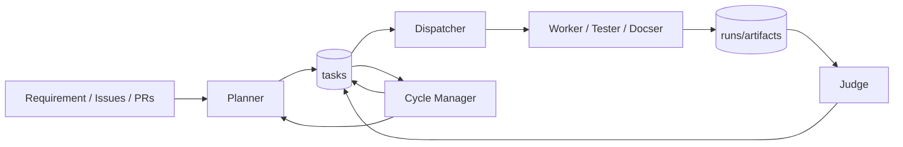

# Architecture Overview

openTiger is an orchestration system that continues autonomous execution using multiple agents and state tables.

Related:

- [state-model](state-model.md)
- [flow](flow.md)
- [operations](operations.md)
- [startup-patterns](startup-patterns.md)
- [agent/README](agent/README.md)
- [mode](mode.md)
- [execution-mode](execution-mode.md)
- [research](research.md)
- [plugins](plugins.md)

## Table of Contents

- [0. Runtime Control Loop (Overview)](#0-runtime-control-loop-overview)
- [1. Components](#1-components)
- [2. Data Stores](#2-data-stores)
- [3. High-Level Execution Flow](#3-high-level-execution-flow)
- [4. State Design Characteristics](#4-state-design-characteristics)
- [5. Modes and Execution Environment](#5-modes-and-execution-environment)

## 0. Runtime Control Loop (Overview)

This loop prioritizes "never stopping"; on failure, recovery strategy is switched via state transition.

TigerResearch is implemented as a planner-first plugin specialization on top of the same loop:

- entry via `POST /plugins/tiger-research/jobs`
- planner decomposition via `--research-job`
- runtime execution via `tasks.kind=research`
- convergence via Cycle Manager + Judge

### Reading Order for Incident Investigation (Common Lookup Path)

After understanding the architecture, when investigating incidents, tracing in the order state vocabulary -> transition -> owner -> implementation is shortest.

1. Confirm state vocabulary in [state-model](state-model.md)
2. Check transitions and recovery paths in [flow](flow.md)
3. Run API procedures and operational shortcuts in [operations](operations.md)
4. Identify owning agent and implementation tracing path in [agent/README](agent/README.md)

## 1. Components

### Service Layer (API / `@openTiger/api`)

- Dashboard backend
- Config management (`/config`)
- System control (`/system/*`)
- Read APIs (`/tasks`, `/runs`, `/agents`, `/plans`, `/judgements`, `/logs`)

### Planning Layer (Planner / `@openTiger/planner`)

- Generate task plans from requirement / issue
- Dependency normalization
- Policy application
- Documentation gap detection
- Details: [agent/planner](agent/planner.md)

### Dispatch Control Layer (Dispatcher / `@openTiger/dispatcher`)

- Select `queued` tasks
- Acquire lease
- Assign execution agents
- Process / Docker startup
- Details: [agent/dispatcher](agent/dispatcher.md)

### Execution Layer (Worker / Tester / Docser / `@openTiger/worker`)

- LLM execution (`opencode`, `claude_code`, or `codex`)
- Change verification (commands + policy)
- Commit/push/PR creation (git mode)
- Recovery branching on failure
- Details: [agent/worker](agent/worker.md), [agent/tester](agent/tester.md), [agent/docser](agent/docser.md)

### Judgement Layer (Judge / `@openTiger/judge`)

- Evaluate successful runs (CI / policy / LLM)
- Approve / request_changes decision
- Merge / retry / autofix task creation
- Details: [agent/judge](agent/judge.md)

### Convergence Layer (Cycle Manager / `@openTiger/cycle-manager`)

- Cleanup loop
- `failed/blocked` recovery
- Issue backlog sync
- Replan decision
- Details: [agent/cycle-manager](agent/cycle-manager.md)

### Dashboard Layer (Dashboard / `@openTiger/dashboard`)

- UI for startup/config/state monitoring
- Process start/stop
- Task/run/judgement/log display

### TigerResearch Subsystem (Cross-Cutting)

- Query entry and job lifecycle API (`/plugins/tiger-research/*`)
- Planner-first claim decomposition
- Claim-level parallel collection/challenge/write tasks
- Research quality convergence loop
- Full UI observability from dashboard `plugins` section

## 2. Data Stores

### Persistent Store (PostgreSQL)

Main tables:

- `tasks`
- `runs`
- `artifacts`
- `leases`
- `events`
- `agents`
- `cycles`
- `config`
- TigerResearch plugin tables (`packages/db/src/plugins/tiger-research.ts`)

### Message Queue (Redis / BullMQ)

- Task queue
- Dead-letter queue
- Worker concurrency/lock control

## 3. High-Level Execution Flow

1. Planner creates tasks (`queued`)
2. Dispatcher acquires lease and moves to `running`
3. Worker/Tester/Docser execute and verify
4. On success: `blocked(awaiting_judge)` or `done`
5. Judge evaluates and moves to `done` / retry / rework
6. Cycle Manager continues recovery and replanning

TigerResearch path:

1. API creates plugin job row (`research_jobs`)
2. Planner decomposes query to claims
3. Dispatcher/Worker execute research tasks in parallel
4. Cycle Manager drives collect/challenge/write/rework
5. Judge applies research quality decision (when enabled)

Details in [flow](flow.md).

## 4. State Design Characteristics

- Explicit blocked reason
  - `awaiting_judge`
  - `quota_wait`
  - `needs_rework`
  - `issue_linking` (for Planner internal coordination)
- Duplicate execution prevention
  - lease
  - runtime lock
  - Judge idempotency (`judgedAt`, `judgementVersion`)

## 5. Modes and Execution Environment

- Repository mode
  - `git` / `local`
- Judge mode
  - `git` / `local` / `auto`
- Execution environment
  - `host` (process)
  - `sandbox` (docker)

Details in [mode](mode.md) and [execution-mode](execution-mode.md).
