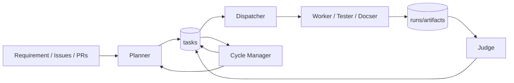

# アーキテクチャ概要

openTiger は、複数エージェントと状態管理テーブルを使って自律実行を継続するオーケストレーションシステムです。

関連:

- `docs/state-model.md`
- `docs/flow.md`
- `docs/operations.md`
- `docs/startup-patterns.md`
- `docs/agent/README.md`
- `docs/mode.md`
- `docs/execution-mode.md`

## 0. ランタイム制御ループ（概要）

このループは「停止しない」ことを優先し、失敗時に状態遷移で回復戦略を切り替える設計です。

### 障害時に読む順番（共通逆引き導線）

アーキテクチャを把握したあと、障害調査へ進むときは、状態語彙 -> 遷移 -> 担当 -> 実装の順で追うと最短です。

1. `docs/state-model.md` で状態語彙を確定する
2. `docs/flow.md` で遷移と回復経路を確認する
3. `docs/operations.md` で API 手順と運用ショートカットを実行する
4. `docs/agent/README.md` で担当 agent と実装追跡ルートを特定する

## 1. コンポーネント

### サービス層（API / `@openTiger/api`）

- Dashboard 向けバックエンド
- 設定管理 (`/config`)
- システム制御 (`/system/*`)
- 参照系 API (`/tasks`, `/runs`, `/agents`, `/plans`, `/judgements`, `/logs`)

### 計画層（Planner / `@openTiger/planner`）

- requirement / issue からタスク計画を生成
- 依存関係（dependency）の正規化
- policy の適用
- documentation gap の検知
- 詳細: `docs/agent/planner.md`

### 配布制御層（Dispatcher / `@openTiger/dispatcher`）

- `queued` タスクの選別
- lease 取得
- 実行エージェント割り当て
- process / Docker の起動
- 詳細: `docs/agent/dispatcher.md`

### 実行層（Worker / Tester / Docser / `@openTiger/worker`）

- LLM 実行（`opencode` または `claude_code`）
- 変更検証（commands + policy）
- commit/push/PR 作成（`git` mode）
- 失敗時の回復分岐
- 詳細: `docs/agent/worker.md`, `docs/agent/tester.md`, `docs/agent/docser.md`

### 判定層（Judge / `@openTiger/judge`）

- 成功 run の評価（CI / policy / LLM）
- approve / request_changes の判断
- merge / retry / autofix タスク生成
- 詳細: `docs/agent/judge.md`

### 収束管理層（Cycle Manager / `@openTiger/cycle-manager`）

- cleanup ループ
- `failed/blocked` の回復
- issue backlog の同期
- replan 判定
- 詳細: `docs/agent/cycle-manager.md`

### ダッシュボード層（Dashboard / `@openTiger/dashboard`）

- 起動/設定/状態監視の UI
- process の start/stop
- task/run/judgement/log の表示

## 2. データストア

### 永続データストア（PostgreSQL）

主要テーブル:

- `tasks`
- `runs`
- `artifacts`
- `leases`
- `events`
- `agents`
- `cycles`
- `config`

### メッセージキュー（Redis / BullMQ）

- task queue
- dead-letter queue
- worker の concurrency/lock 制御

## 3. 実行の大まかな流れ

1. Planner がタスクを作成 (`queued`)
2. Dispatcher が lease 取得 + `running` 化
3. Worker/Tester/Docser が実行・検証
4. 成功時は `blocked(awaiting_judge)` または `done`
5. Judge が評価して `done` / retry / rework へ遷移
6. Cycle Manager がリカバリと再計画を継続

詳細は `docs/flow.md` を参照してください。

## 4. 状態設計の特徴

- 明示的な blocked reason
  - `awaiting_judge`
  - `quota_wait`
  - `needs_rework`
  - `issue_linking`（Planner 内部連携用）
- 重複実行防止
  - lease
  - runtime lock
  - judge idempotency (`judgedAt`, `judgementVersion`)

## 5. モードと実行環境

- リポジトリモード（Repository mode）
  - `git` / `local`
- 判定モード（Judge mode）
  - `git` / `local` / `auto`
- 実行環境（Execution environment）
  - `host`（process）
  - `sandbox`（docker）

詳細は `docs/mode.md` と `docs/execution-mode.md` を参照してください。
