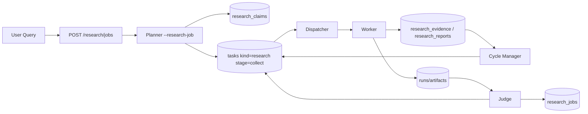

# TigerResearch Specification

TigerResearch is openTiger's query-driven research subsystem.
It runs a planner-first, claim/evidence convergence loop on top of existing orchestration (`tasks/runs/dispatcher/worker/judge/cycle-manager`).

Related:

- `docs/architecture.md`
- `docs/flow.md`
- `docs/api-reference.md`
- `docs/config.md`
- `docs/operations.md`
- `docs/agent/README.md`

## 1. What TigerResearch Does

TigerResearch is not a simple "single search + summary" path.
It executes:

1. Query decomposition (Planner)
2. Parallel claim-level evidence collection (Worker)
3. Counter-evidence challenge (Worker)
4. Synthesis/write stage (Worker)
5. Quality gate + convergence/rework (Cycle Manager + Judge)

Result:

- Claims, evidence, reports are persisted in research tables
- Runtime traceability is preserved via tasks/runs/artifacts/events

## 2. Architecture (Planner-First)

Key design points:

- Planner-first start (`POST /research/jobs` starts planner with `researchJobId`)
- Worker uses a non-git execution path for `task.kind=research`
- Manual role selection is not required in UI; research tasks run with `role=worker`
- Existing code-task pipeline remains unchanged

## 3. Data Model

Runtime reuse:

- `tasks`, `runs`, `artifacts`, `events`, `leases`, `agents`

Research domain:

- `research_jobs`
- `research_claims`
- `research_evidence`
- `research_reports`

Primary linkages:

- `tasks.kind = research`
- `tasks.context.research.jobId` links runtime to research domain
- `runs.taskId` links executions
- `originRunId` in research tables preserves provenance

## 4. Stage Model

### 4.1 Task-level stage (`tasks.context.research.stage`)

- `plan`
- `collect`
- `challenge`
- `write`

### 4.2 Job-level orchestrator stage (`research_jobs.metadata.orchestrator.stage`)

Typical values:

- `planning`
- `collecting`
- `challenging`
- `composing`
- `judging`
- `reworking`
- `completed`

### 4.3 Job status (`research_jobs.status`)

- `queued`
- `running`
- `blocked`
- `done`
- `failed`
- `cancelled`

## 5. Lifecycle

## 5.1 Job Creation

`POST /research/jobs` does:

1. Create `research_jobs` row
2. Ensure runtime processes for research
3. Start planner in research mode (`planner --research-job <id>`)
4. If planner startup fails, enqueue fallback `plan` task

Planner pending window:

- `metadata.orchestrator.plannerPendingUntil` is set on creation
- Cycle Manager waits for planner during this window before creating worker fallback plan tasks

## 5.2 Planner Stage

Planner research mode:

- Decomposes query into testable claims (`4-10` when scope allows)
- Persists normalized claims with dedupe
- Enqueues claim-level `collect` tasks
- Updates orchestrator metadata (`plannedAt`, `claimCount`, warnings)

## 5.3 Worker Execution

When `task.kind=research`, worker:

- Skips git checkout/branch/commit/pr steps
- Builds research prompt with:
  - target query/stage/claim
  - existing claims/evidence snapshot
  - seed URLs from query text
- Persists:
  - claim stance/confidence updates
  - evidence rows
  - report rows
  - research artifacts

Search policy:

- No dedicated external search API integration is required
- Runtime model tools (e.g. built-in search capability) are used
- Only seed URLs are pre-extracted from query text

## 5.4 Convergence and Judge

Cycle Manager runs research orchestration tick:

- Auto-queues collect/challenge/write tasks
- Applies quality checks
- Creates targeted rework tasks for insufficient claims

Judge reviews research runs (when required) and decides:

- `approve` -> task/job converge to done
- `request_changes` -> task blocked with `needs_rework`

## 6. Quality Gates

Cycle Manager thresholds (default in code):

- `RESEARCH_MIN_EVIDENCE_PER_CLAIM` (default `3`)
- `RESEARCH_MIN_DISTINCT_DOMAINS_PER_CLAIM` (default `2`)
- `RESEARCH_REQUIRE_COUNTER_EVIDENCE` (default `true`)
- `RESEARCH_MIN_REPORT_CONFIDENCE` (default `70`)
- `RESEARCH_MIN_VERIFIABLE_RATIO` (default `0.9`)
- `RESEARCH_MAX_CONCURRENCY` (default `6`)
- `RESEARCH_MAX_DEPTH` (default `3`)

Judge-specific research thresholds:

- `JUDGE_RESEARCH_MIN_CLAIMS`
- `JUDGE_RESEARCH_MIN_EVIDENCE_PER_CLAIM`
- `JUDGE_RESEARCH_MIN_DISTINCT_DOMAINS_PER_CLAIM`
- `JUDGE_RESEARCH_REQUIRE_COUNTER_EVIDENCE`
- `JUDGE_RESEARCH_MIN_CONFIDENCE`
- `JUDGE_RESEARCH_MIN_VERIFIABLE_RATIO`

Judge enablement for research:

- `RESEARCH_REQUIRE_JUDGE=true|false`

## 7. API Endpoints

Research routes:

- `GET /research/jobs`
- `GET /research/jobs/:id`
- `POST /research/jobs`
- `POST /research/jobs/:id/tasks`
- `DELETE /research/jobs`

Notes:

- `POST /research/jobs` response includes runtime/planner start result
- `POST /research/jobs/:id/tasks` is an operator override for manual stage injection
- `DELETE /research/jobs` deletes research jobs and linked runtime rows in a transaction

## 8. Operational Notes

## 8.1 Expected Runtime

- Dispatcher + Cycle Manager should be running
- At least one `worker-*` should be live in host mode
- Judge runs only when enabled and required for research

## 8.2 Common Failure Pattern: repeated cancelled runs

If you see repeated:

- `Run status: cancelled`
- `errorMessage: Agent process restarted before task completion`

check whether API process restarts are propagating stop signals to managed processes.

Current behavior:

- In API dev lifecycle (`npm_lifecycle_event=dev`), `SIGTERM` preserves managed processes by default.
- Override with `OPENTIGER_PRESERVE_MANAGED_ON_DEV_SIGTERM=false` to restore strict shutdown behavior.

## 8.3 First Checks

1. `GET /system/processes`
2. `GET /agents`
3. `GET /research/jobs`
4. `GET /tasks` (research tasks only)
5. `GET /runs` + `GET /logs/all`

## 9. Implementation Reference (Source of Truth)

- API routes: `apps/api/src/routes/research.ts`
- Runtime bootstrap: `apps/api/src/routes/research-runtime.ts`
- Planner research strategy: `apps/planner/src/strategies/from-research-query.ts`
- Planner research runner: `apps/planner/src/planner-runner.ts`
- Worker research execution: `apps/worker/src/research/runner.ts`
- Worker research persistence: `apps/worker/src/research/persist.ts`
- Cycle research orchestration: `apps/cycle-manager/src/main/research-orchestrator.ts`
- Judge research review: `apps/judge/src/judge-research.ts`
