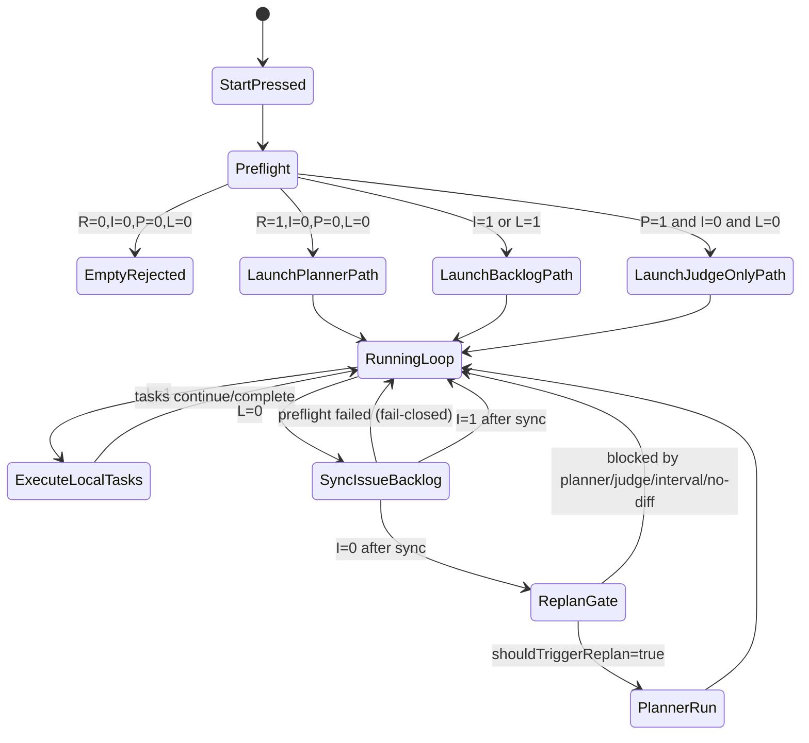

# 起動と実行時のパターン行列

このドキュメントは、実装に合わせて次の判定パターンを整理したものです。

1. 起動時 `/system/preflight` の推奨判定
2. `cycle-manager` の runtime 収束ループ
3. Planner 起動時の prehook guard（`/system/processes/:name/start`）

最終検証日: 2026-02-13

## 関連

- `docs/api-reference.md`
- `docs/flow.md`
- `docs/agent/planner.md`
- `docs/agent/dispatcher.md`
- `docs/agent/judge.md`
- `docs/agent/cycle-manager.md`

## スコープ

このページは次だけを扱います。

1. 起動時 preflight の意思決定
2. planner 起動ガード
3. backlog 枯渇後の replan 入口条件

run の失敗処理、blocked 回復、judge/worker の詳細状態遷移は `docs/flow.md` を参照してください。

## 判定入力

| 記号 | 意味 | 取得元 |
| --- | --- | --- |
| `R` | Requirement が空でない | `/system/preflight` リクエスト本文 |
| `I` | Issue task backlog が存在する | `preflight.github.issueTaskBacklogCount > 0` |
| `P` | PR/Judge backlog が存在する | `openPrCount > 0 OR pendingJudgeTaskCount > 0` |
| `L` | ローカル task backlog が存在する | `queued/running/failed/blocked > 0` |

## 判定責務

| 判定 | 主担当コンポーネント |
| --- | --- |
| preflight recommendation | API（`/system/preflight`） |
| planner start guard | API process prehook（`/system/processes/planner/start`） |
| queued task の選別と lease 付与 | Dispatcher |
| run 評価と PR merge 系分岐 | Judge |
| backlog 収束、preflight sync、replan 起動判定 | Cycle Manager |

## 起動時ルール

現在の判定式:

- `startPlanner = R && !I && !P && !L`
- `startExecutionAgents = startPlanner || I || L`
- `startDispatcher = dispatcherEnabled && startExecutionAgents`
- `startJudge = judgeEnabled && (P || startExecutionAgents)`
- `startCycleManager = cycleManagerEnabled && (startExecutionAgents || P || blockedTaskCount > 0)`
- `worker/tester/docser count = configured count if startExecutionAgents else 0`

`!startPlanner && backlogTotal == 0` の場合、Start UI は次を返します。

- `Requirements empty and no issue/PR backlog found`

## パターンクラス一覧

`R/I/P/L` の 16 組み合わせは、実運用上は次のクラスに集約できます（同じ出力は統合）。

| Class | 条件 | Planner | Dispatcher/Worker/Tester/Docser | Judge | 期待挙動 |
| --- | --- | --- | --- | --- | --- |
| S0 | `R=0,I=0,P=0,L=0` | No | No | No | Start は reject（処理対象なし） |
| S1 | `R=1,I=0,P=0,L=0` | Yes | Yes | Yes | Planner で task 生成後に通常実行 |
| S2 | `I=1`（`R/P/L` は任意） | No | Yes | Yes | Issue backlog を最優先で処理 |
| S3 | `P=1,I=0,L=0`（`R` は任意） | No | No | Yes | Judge backlog のみを処理 |
| S4 | `L=1,I=0,P=0`（`R` は任意） | No | Yes | Yes | 既存ローカル task を先に処理 |
| S5 | `L=1,P=1,I=0`（`R` は任意） | No | Yes | Yes | ローカル backlog + Judge backlog を先に処理 |

補足:

- `I=1` がある場合は planner が無効化され、実行系が有効化されるため実質的に最優先です。
- `L=0` で `P=1` の場合は dispatcher/worker を起動しなくても Judge が起動対象になります。Judge が停止中なら system process self-heal が backlog を検知して自動再起動します。
- `R=1` 単独で planner を起動できるのは、`I/P/L` がすべて 0 のときだけです。

## プランナー（Planner）起動ガード

`POST /system/processes/planner/start` を直接呼んだ場合でも、次のいずれかが真なら planner 起動は `409` で拒否されます。

1. Local task backlog (`L=1`)
2. Issue backlog (`I=1`)
3. PR/Judge backlog (`P=1`)

これにより、Start UI を経由しない起動でも同じ優先順が維持されます。

## 実行時収束ループ（Cycle Manager）

`cycle-manager` 稼働中は次の順で収束を進めます。

1. If local task backlog exists (`L=1`), keep executing tasks.
2. If local task backlog is empty, call `/system/preflight` to sync/import issue and PR backlog.
3. If issue backlog exists after sync (`I=1`), do not replan.
4. Only when `L=0` and `I=0`, evaluate replan gates.
5. さらに replan 固有ガード（planner busy / recent active / pending judge / interval / no-diff）を満たした場合のみ replan を実行します。

## 状態遷移図

## 重要なエッジパターン

| パターン | 何が起きるか |
| --- | --- |
| Issue は存在するが explicit role が不足 | Issue task が `blocked(issue_linking)` のまま残る場合があり、issue metadata が整うまで planner は進みません |
| preflight で GitHub 問い合わせ失敗 | warning が出力され、残りのローカル信号に依存して Start 判定されます |
| runtime の issue-sync リクエスト失敗 | その cycle では replan をスキップします（fail-closed） |
| backlog がある状態で manual planner start | planner prehook で `409` 拒否されます |
