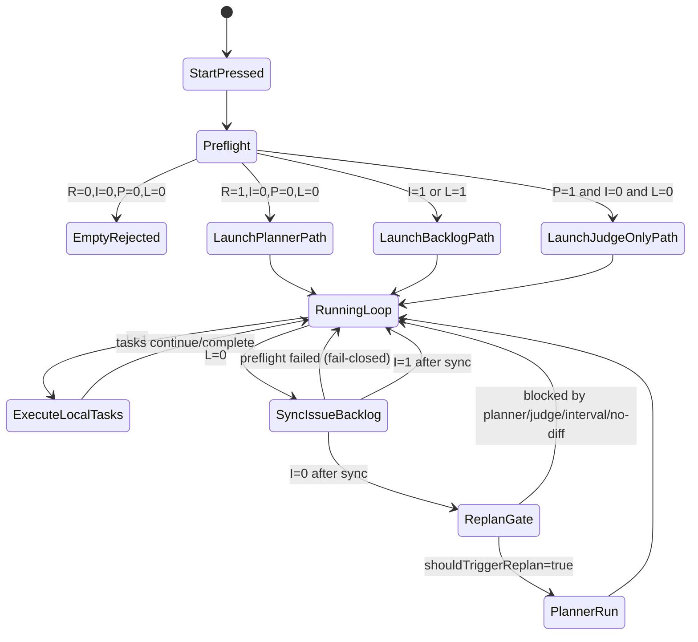

# Startup and Runtime Pattern Matrix

This document organizes the following decision patterns to match implementation:

1. Startup `/system/preflight` recommendation rules
2. `cycle-manager` runtime convergence loop
3. Planner startup prehook guards (`/system/processes/:name/start`)

Last verified: 2026-02-13

## Related

- `docs/api-reference.md`
- `docs/flow.md`
- `docs/agent/planner.md`
- `docs/agent/dispatcher.md`
- `docs/agent/judge.md`
- `docs/agent/cycle-manager.md`

## Scope

This page covers only:

1. Startup preflight decision
2. Planner startup guard
3. Replan entry conditions after backlog depletion

For run failure handling, blocked recovery, and detailed state transitions in judge/worker, see `docs/flow.md`.

### Common Lookup Path (State Vocabulary -> Transition -> Owner -> Implementation, When Entering from Startup Rules)

When tracing stalls from startup rules, follow: state vocabulary -> transition -> owner -> implementation.

1. `docs/state-model.md` (state vocabulary)
2. `docs/flow.md` (runtime transitions and recovery paths)
3. `docs/operations.md` (API procedures and operation shortcuts)
4. `docs/agent/README.md` (owning agent and implementation tracing path)

## Decision Inputs

| Symbol | Meaning                   | Source                                         |
| ------ | ------------------------- | ---------------------------------------------- |
| `R`    | Requirement is non-empty  | `/system/preflight` request body               |
| `I`    | Issue task backlog exists | `preflight.github.issueTaskBacklogCount > 0`   |
| `P`    | PR/Judge backlog exists   | `openPrCount > 0 OR pendingJudgeTaskCount > 0` |
| `L`    | Local task backlog exists | `queued`/`running`/`failed`/`blocked` > 0      |

## Decision Responsibility

| Decision                                            | Primary component                                       |
| --------------------------------------------------- | ------------------------------------------------------- |
| Preflight recommendation                            | API (`/system/preflight`)                               |
| Planner startup guard                               | API process prehook (`/system/processes/planner/start`) |
| Queued task selection and lease grant               | Dispatcher                                              |
| Run evaluation and PR merge branching               | Judge                                                   |
| Backlog convergence, preflight sync, replan trigger | Cycle Manager                                           |

## Startup Rules

Current formulas:

- `startPlanner = R && !I && !P && !L`
- `startExecutionAgents = startPlanner || I || L`
- `startDispatcher = dispatcherEnabled && startExecutionAgents`
- `startJudge = judgeEnabled && (P || startExecutionAgents)`
- `startCycleManager = cycleManagerEnabled && (startExecutionAgents || P || blockedTaskCount > 0)`
- `worker/tester/docser count = configured count if startExecutionAgents else 0`

When `!startPlanner && backlogTotal == 0`, Start UI returns:

- `Requirements empty and no issue/PR backlog found`

## Pattern Classes

The 16 combinations of `R/I/P/L` collapse into these classes in practice (same output merged):

| Class | Condition               | Planner | Dispatcher/Worker/Tester/Docser | Judge | Expected behavior                            |
| ----- | ----------------------- | ------- | ------------------------------- | ----- | -------------------------------------------- |
| S0    | `R=0,I=0,P=0,L=0`       | none    | none                            | none  | Start rejects (nothing to process)           |
| S1    | `R=1,I=0,P=0,L=0`       | yes     | yes                             | yes   | Normal execution after Planner creates tasks |
| S2    | `I=1` (any `R/P/L`)     | none    | yes                             | yes   | Issue backlog highest priority               |
| S3    | `P=1,I=0,L=0` (any `R`) | none    | none                            | yes   | Process Judge backlog only                   |
| S4    | `L=1,I=0,P=0` (any `R`) | none    | yes                             | yes   | Process existing local tasks first           |
| S5    | `L=1,P=1,I=0` (any `R`) | none    | yes                             | yes   | Local backlog + Judge backlog first          |

Notes:

- When `I=1`, planner is disabled and execution agents enabled, so Issue is effectively highest priority
- When `L=0` and `P=1`, Judge can start without dispatcher/worker. System process self-recovery detects backlog and auto-restarts Judge when stopped
- Planner can start only when `I/P/L` are all 0 and `R=1`

## Planner Startup Guard

Even when `POST /system/processes/planner/start` is called directly, planner start is rejected with `409` if any of:

1. Local task backlog (`L=1`)
2. Issue backlog (`I=1`)
3. PR/Judge backlog (`P=1`)

This keeps the same priority when starting without going through Start UI.

## Runtime Convergence Loop (Cycle Manager)

When `cycle-manager` is running, convergence proceeds as:

1. If local task backlog exists (`L=1`), continue task execution
2. If local task backlog is empty, call `/system/preflight` to sync/import issue/PR backlog
3. If issue backlog exists after sync (`I=1`), do not replan
4. Replan gate is evaluated only when `L=0` and `I=0`
5. Replan runs only when replan-specific guards (planner busy / recent active / pending judge / interval / no-diff) are satisfied

## State Diagram

## Important Edge Patterns

| Pattern                                | What happens                                                                                            |
| -------------------------------------- | ------------------------------------------------------------------------------------------------------- |
| Issue exists but explicit role missing | Issue task may stay `blocked(issue_linking)` until issue metadata is complete; planner does not proceed |
| GitHub query fails in preflight        | Warning emitted; Start decision falls back to remaining local signals                                   |
| Issue-sync request fails at runtime    | Replan skipped for that cycle (fail-closed)                                                             |
| Manual planner start with backlog      | Rejected with `409` by planner prehook                                                                  |
