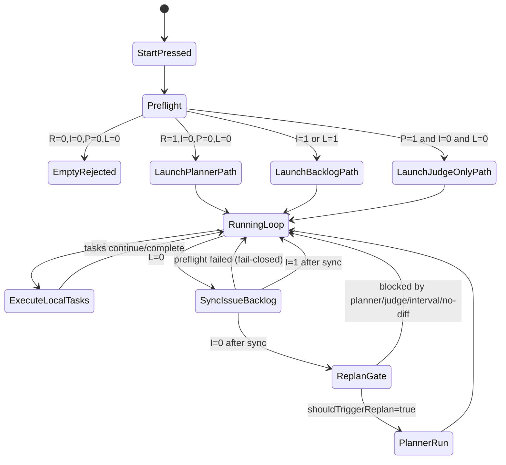

# Startup and Runtime Pattern Matrix

This document describes the code-aligned decision patterns for:

1. `/system/preflight` recommendations at start time
2. Runtime convergence loop in `cycle-manager`
3. Planner prehook guard (`/system/processes/:name/start` for planner)

Last verified against code on 2026-02-10.

## Decision Inputs

| Symbol | Meaning                          | Source                                         |
| ------ | -------------------------------- | ---------------------------------------------- |
| `R`    | Requirement content is non-empty | `/system/preflight` request body               |
| `I`    | Issue task backlog exists        | `preflight.github.issueTaskBacklogCount > 0`   |
| `P`    | PR/Judge backlog exists          | `openPrCount > 0 OR pendingJudgeTaskCount > 0` |
| `L`    | Local task backlog exists        | `queued/running/failed/blocked > 0`            |

## Start-Time Rules

Current formulas:

- `startPlanner = R && !I && !P && !L`
- `startExecutionAgents = startPlanner || I || L`
- `startDispatcher = dispatcherEnabled && startExecutionAgents`
- `startJudge = judgeEnabled && (P || startExecutionAgents)`
- `startCycleManager = cycleManagerEnabled && (startExecutionAgents || P || blockedTaskCount > 0)`
- `worker/tester/docser count = configured count if startExecutionAgents else 0`

If `!startPlanner && backlogTotal == 0`, Start UI returns:

- `Requirements empty and no issue/PR backlog found`

## Exhaustive Pattern Classes

The 16 boolean combinations of `R/I/P/L` collapse into the classes below (same outputs are grouped):

| Class | Condition               | Planner | Dispatcher/Worker/Tester/Docser | Judge | Expected behavior                              |
| ----- | ----------------------- | ------- | ------------------------------- | ----- | ---------------------------------------------- |
| S0    | `R=0,I=0,P=0,L=0`       | No      | No                              | No    | Start is rejected (nothing to do)              |
| S1    | `R=1,I=0,P=0,L=0`       | Yes     | Yes                             | Yes   | Planner generates tasks, then normal execution |
| S2    | `I=1` (any `R/P/L`)     | No      | Yes                             | Yes   | Issue backlog is processed first               |
| S3    | `P=1,I=0,L=0` (any `R`) | No      | No                              | Yes   | Judge-only backlog processing                  |
| S4    | `L=1,I=0,P=0` (any `R`) | No      | Yes                             | Yes   | Existing local tasks are processed first       |
| S5    | `L=1,P=1,I=0` (any `R`) | No      | Yes                             | Yes   | Local backlog + judge backlog first            |

Notes:

- `I=1` has highest practical priority because planner is disabled and execution agents are enabled.
- `P=1` without `L` enables Judge, even if dispatcher/workers are not started.
- `R=1` alone triggers planner only when no backlog exists anywhere (`I/P/L` all zero).

## Planner Prehook Guard

Even if someone directly calls `POST /system/processes/planner/start`, planner launch is blocked with `409` when any of these are true:

1. Local task backlog (`L=1`)
2. Issue backlog (`I=1`)
3. PR/Judge backlog (`P=1`)

This enforces the same ordering outside the Start UI.

## Runtime Convergence Loop (Cycle Manager)

When `cycle-manager` is running:

1. If local task backlog exists (`L=1`), keep executing tasks.
2. If local task backlog is empty, call `/system/preflight` to sync/import issue and PR backlog.
3. If issue backlog exists after sync (`I=1`), do not replan.
4. Only when `L=0` and `I=0`, evaluate replan gates.
5. Replan still requires additional guards to pass (planner not busy/recently active, no pending judge runs, interval/no-diff checks).

## State Transition Diagram

## Important Edge Patterns

| Pattern                                   | What happens                                                                   |
| ----------------------------------------- | ------------------------------------------------------------------------------ |
| Issue exists but explicit role missing    | Issue backlog stays non-zero; planner is blocked until issue metadata is fixed |
| GitHub query failed in preflight          | Warnings are emitted; Start behavior depends on remaining local signals        |
| Runtime issue-sync request failed         | `cycle-manager` skips replan for that cycle (fail-closed)                      |
| Manual planner start while backlog exists | Rejected by planner prehook (`409`)                                            |
